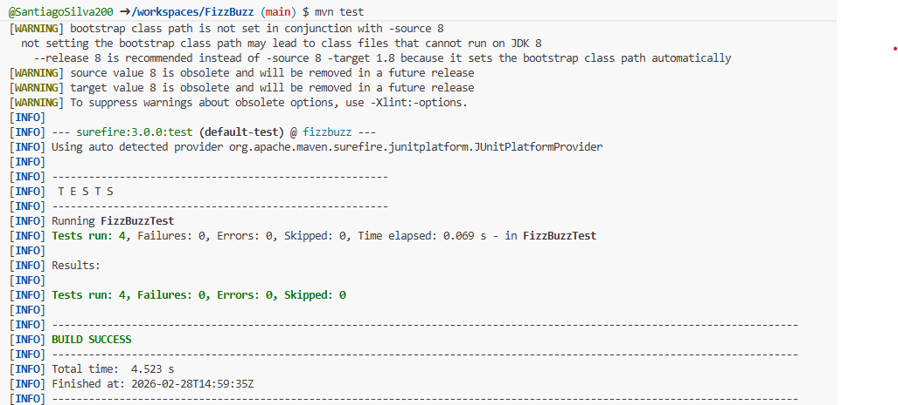
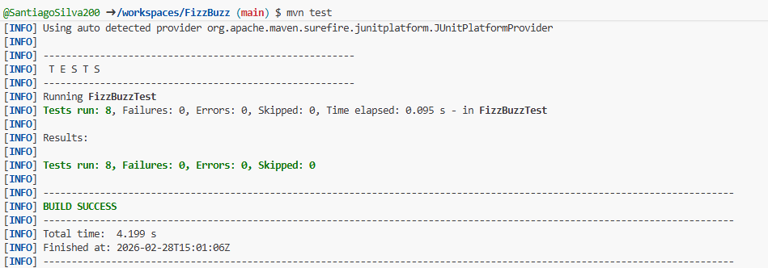
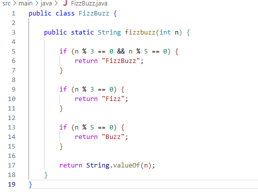
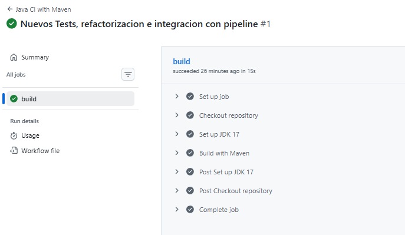

# Laboratorio: TDD con FizzBuzz

## Objetivo

El objetivo de este laboratorio es aplicar la metodología TDD (Test Driven Development) mediante la implementación del ejercicio FizzBuzz en Java usando GitHub Codespaces, JUnit y Maven.

## ¿Cómo se aplicó TDD en este laboratorio?

Durante el desarrollo del ejercicio:

- Se creó una primera prueba para validar que el método devolviera el número cuando no era múltiplo de 3 ni 5.
- Se implementó el código mínimo necesario para que la prueba pasara.
- Se añadieron pruebas para múltiplos de 3, 5 y 3 y 5.
- Se refactorizó el código para mejorar su claridad sin afectar las pruebas.
- Se integró un pipeline CI/CD con GitHub Actions para ejecutar automáticamente las pruebas en cada push.

## Implementación

### Primera ejecución exitosa de pruebas

### Nuevas pruebas agregadas y ejecutadas

### Código refactorizado

### Integración con GitHub Actions (Pipeline en verde)

## Conclusión

Este laboratorio permitió aplicar correctamente el ciclo TDD, validar el funcionamiento del código mediante pruebas unitarias y automatizar su verificación con integración continua.  

Se evidenció cómo TDD ayuda a desarrollar software de manera más organizada, segura y confiable.